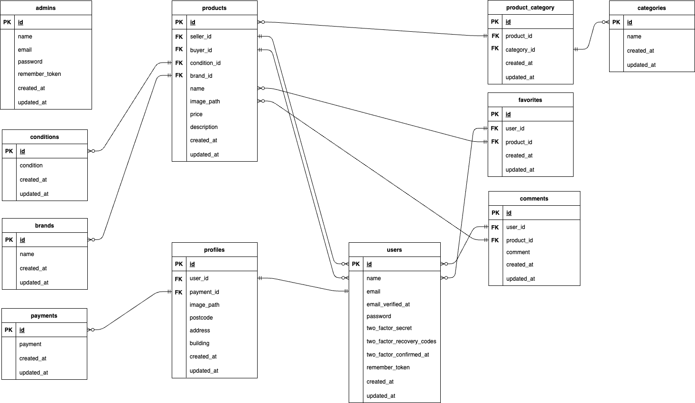

## アプリケーション名
frema

## 作成した目的
フリマアプリ
オンライン上で物品の売買ができる

## URL
- 開発環境：http://localhost/
- phpMyAdmin:：http://localhost:8080/
- 本番環境：http://atte.blog

## 機能一覧
- 会員登録
- ログイン
- ログアウト
- 商品一覧取得
- 商品詳細取得
- 商品お気に入り一覧取得
- 商品おすすめ一覧取得
- ユーザー情報取得(マイページ)
- ユーザー購入商品一覧取得
- ユーザー出品商品一覧取得
- プロフィール変更
- 商品お気に入り追加
- 商品お気に入り削除
- 商品コメント取得
- 商品コメント追加
- コメント一覧取得
- 商品コメント削除
- 商品出品
- 商品検索
- ユーザー一覧取得
- ユーザー削除
- メール送信
- 支払い方法変更
- 住所変更
- 商品購入(クレジットカード払い)

## 機能補足

##### 会員登録
非ログイン状態でトップページにアクセスし、ナビゲーションバーの「会員登録」ボタンをクリックで会員登録画面に移動  
各欄を記入後に「登録する」ボタンをクリックで会員登録ができる  
<br>

##### ログイン
ログインは、adminもしくはuserの2つの役割で行える  
adminは管理者アカウントで、コメント削除、ユーザー削除、メール送信機能などが利用できる  
userは一般ユーザーアカウントで、お気に入り機能、マイページ機能、プロフィールの変更機能、コメント機能、商品の出品機能、商品の出品機能などが利用できる  
シーディング後、下記2つのアカウントを使用できます  

admin(管理者)  Email:jackson5@kingofpop.example Password:password  
user(一般ユーザー) Email:uncle-kerl@calbee.example Password:password  
<br>

##### ログアウト
ログイン状態でナビゲーションバーの「ログアウト」ボタンをクリックでログアウトができる  
<br>

##### 商品一覧取得
ヘッダーの左端にあるロゴをクリックで商品一覧を取得できる(トップページ)  
<br>

##### 商品詳細取得
商品画像をクリックで商品詳細ページに移動、名前・ブランド・値段・商品説明・カテゴリー・商品の状態の情報、お気に入りボタン・コメントボタン・購入するボタンの表示がされる  
<br>

##### 商品お気に入り一覧取得
userアカウント、uncle-kerl@calbee.exampleでログイン後、商品一覧ページ(トップページ)で「マイリスト」をクリックで商品お気に入り一覧を表示できる  
非ログイン状態ではお気に入り情報がないので、商品は何も表示されない  
<br>

##### 商品おすすめ一覧取得
商品一覧ページ(トップページ)で「おすすめ」をクリックで商品おすすめ一覧を表示できる  
<br>

##### ユーザー情報取得(マイページ)
userアカウント、uncle-kerl@calbee.exampleでログイン後、ナビゲーションバーのマイページを選択  
<br>

##### ユーザー購入商品一覧取得
userアカウント、uncle-kerl@calbee.exampleでログイン後、ナビゲーションバーのマイページをクリックして移動後「購入した商品」をクリック  
<br>

##### ユーザー出品商品一覧取得
userアカウント、uncle-kerl@calbee.exampleでログイン後、ナビゲーションバーの「マイページ」をクリックして移動後「出品した商品」をクリック  
<br>

##### プロフィール変更
userアカウント、uncle-kerl@calbee.exampleでログイン後、ナビゲーションバーのマイページをクリックして移動後「プロフィールを編集」をクリック  
「プロフィール設定」画面に移動するので、各欄を記入後、ページ下部の「更新する」ボタンをクリックでプロフィールの変更ができる  
<br>

##### 商品お気に入り追加・削除
userアカウント、uncle-kerl@calbee.exampleでログイン後、商品をクリックして商品詳細ページに移動、値段の下にある「星アイコン」をクリックで追加・削除できる  
<br>

##### 商品コメント取得
商品をクリックして商品詳細ページに移動、値段の下にある「吹き出しアイコン」をクリックでコメントページに移動  
画面右に商品に対するコメントが表示される  
<br>

##### 商品コメント追加
userアカウント、uncle-kerl@calbee.exampleでログイン後、商品をクリックして商品詳細ページに移動、値段の下にある「吹き出しアイコン」をクリックでコメントページに移動  
ページ右下の「商品へのコメント」入力欄でコメントを入力後、「コメントを送信する」ボタンをクリックでコメントを追加できる  
<br>

##### コメント一覧取得
adminアカウント、jackson5@kingofpop.exampleでログイン後、ナビゲーションバーの「コメント一覧」を選択  
全てのコメントが表示される  
<br>

##### 商品コメント削除
adminアカウント、jackson5@kingofpop.exampleでログイン後、ナビゲーションバーの「コメント一覧」を選択  
コメント一覧ページに移動後、コメントの右端にある削除を選択、確認のポップアップウインドウが出るので、「削除する」をクリックでコメントを削除  
<br>

##### 商品出品
userアカウント、uncle-kerl@calbee.exampleでログイン後、ナビゲーションバーの「出品」をクリックして出品ページに移動  
各入力欄を入力後、「出品する」ボタンをクリックで商品の出品ができる  
<br>

##### 商品検索
ヘッダーの検索欄(何をお探しですか？)にワードを入力することで、「商品名」と「商品説明」から検索できる  
<br>

##### ユーザー一覧取得
adminアカウント、jackson5@kingofpop.exampleでログイン後、ナビゲーションバーの「ユーザー一覧」を選択  
全てのユーザーが表示される  
<br>

##### ユーザー削除
adminアカウント、jackson5@kingofpop.exampleでログイン後、ナビゲーションバーの「ユーザー一覧」を選択  
ユーザー一覧ページに移動後、コメントの右端にある削除を選択、確認のポップアップウインドウが出るので、「削除する」をクリックでユーザーを削除  
<br>

##### メール送信
adminアカウント、jackson5@kingofpop.exampleでログイン後、ナビゲーションバーの「メール」を選択  
メールフォームページに移動後、「件名」と「本文」を入力後、「送信ボタン」をクリックでユーザー全員にメールを送信できる  
<br>

##### 支払い方法変更
userアカウント、uncle-kerl@calbee.exampleでログイン後、商品をクリックして商品詳細ページに移動、「購入する」をクリックで購入ページに移動  
支払い方法の右にある「変更する」ボタンをクリックで支払い方法の変更ページに移動、変更したい支払い方法を選択後「更新する」ボタンをクリックで支払い方法の変更ができる  
<br>

##### 住所変更
userアカウント、uncle-kerl@calbee.exampleでログイン後、商品をクリックして商品詳細ページに移動、「購入する」をクリックで購入ページに移動  
配送先の右にある「変更する」ボタンをクリックで住所の変更ページに移動、各欄を記入後「更新する」ボタンをクリックで住所の変更ができる  
<br>

##### 商品購入(クレジットカード払い)
userアカウント、uncle-kerl@calbee.exampleでログイン後、商品をクリックして商品詳細ページに移動、「購入する」をクリックで購入ページに移動  
ページ移動後に再度「購入する」ボタンをクリックでクレジット決済ページに移動後、クレジットカード情報を入力して「支払い」ボタンをクリックで購入できる  
<br>

## 使用技術(実行環境)
- PHP8.3.3
- Laravel8.83.8
- MySQL8.0.26

## ER図


## 環境構築
**Dockerビルド**
1. `git clone git@github.com:cobaaan/frema.git`
2. DockerDesktopアプリを立ち上げる
3. `docker-compose up -d --build`

> *MacのM1・M2チップのPCの場合、`no matching manifest for linux/arm64/v8 in the manifest list entries`のメッセージが表示されビルドができないことがあります。
エラーが発生する場合は、docker-compose.ymlファイルの「mysql」内に「platform」の項目を追加で記載してください*
``` bash
mysql:
    platform: linux/x86_64(この文追加)
    image: mysql:8.0.26
    environment:
```

**Laravel環境構築**
1. `docker-compose exec php bash`
2. `composer install`
3. 「.env.example」ファイルを 「.env」ファイルに命名を変更。または、新しく.envファイルを作成
4. .envに以下の環境変数を追加
``` text
DB_CONNECTION=mysql
DB_HOST=mysql
DB_PORT=3306
DB_DATABASE=laravel_db
DB_USERNAME=laravel_user
DB_PASSWORD=laravel_pass
```
MAIL関係の設定、下記項目を設定  
``` text
MAIL_MAILER=
MAIL_HOST=
MAIL_PORT=
MAIL_USERNAME=
MAIL_PASSWORD=
MAIL_ENCRYPTION=
MAIL_FROM_ADDRESS=
MAIL_FROM_NAME=
```
STRIPE関係の設定、下記項目を追加して設定  
``` text
STRIPE_PUBLIC_KEY=
STRIPE_SECRET_KEY=
STRIPE_SECRET=
```


1. アプリケーションキーの作成
``` bash
php artisan key:generate
```

1. マイグレーションの実行
``` bash
php artisan migrate
```

1. シーディングの実行
``` bash
php artisan db:seed
```

1. シンボリックリンクの作成
``` bash
php artisan storage:link
```